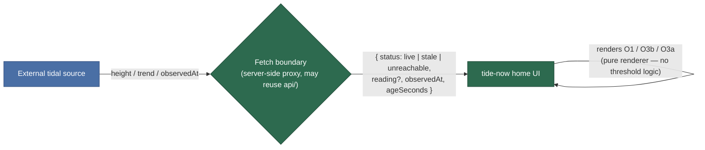

# ADR-001: Tide-feed freshness/integrity contract — the fetch boundary emits a discriminated feed state

---

## Diagram

The freshness comparison (is the reading older than `FRESHNESS_WINDOW_MINUTES`?) happens **at the boundary**, not in the browser. The UI receives an explicit `status` discriminator plus the reading's age and does nothing but render the matching state.

---

## Context

**What is the issue we're trying to solve?**

REQ-web-tide-home v1.2 split the former single "error/stale" state into two distinct
states the walker must be able to tell apart: **O3a — feed unreachable** (no reading
at all) and **O3b — feed reachable but stale** (a real reading, older than the
freshness window, shown marked-with-age). For the UI to render O1 (live), O3a, and
O3b as *distinct* states, some layer contract must tell them apart. R7 already fixes
the *location* of freshness/reachability detection (the server-side fetch boundary)
and O3b reuses the existing `FRESHNESS_WINDOW_MINUTES` lever — but neither governs the
**payload shape** that crosses the boundary into the UI. Without a decided contract,
the frontend build and any future `/api/tide` backend could pick different
discriminators and the O3a/O3b distinction — the entire point of v1.2 — would become
incoherent. This is a lasting fork on a crossing-safety screen, so it is recorded as
the repo's first formal ADR.

**What forces are at play?**

- **Safety single-source-of-truth:** whether a reading is "stale" is a function of the
  freshness threshold; if two layers each decide it, they can disagree and one may show
  a stale reading as live. The threshold and the clock should live in one place.
- **R7 consistency:** R7 says stale/unreachable detection happens *at the fetch
  boundary*. A client-side comparison would move detection into the browser, in tension
  with R7, and duplicate the threshold.
- **No backend today:** on the current static hosting the fetch simply fails, so
  "unreachable" (O3a) is the default production condition now; the contract must define
  the unreachable case as a first-class status, not merely an HTTP error the UI guesses at.
- **Design-first UI (R8):** the visual states are being shaped in the design station;
  the UI should be a pure renderer of a server-decided status so the design owns the
  look and the boundary owns the truth.

---

## Decision

**The fetch boundary is the single authority on feed state, and emits a discriminated
status the UI renders directly.**

The boundary (a server-side proxy, which may reuse `api/server.js` when a backend is
deployed) returns a response carrying:

- `status`: one of `live` | `stale` | `unreachable`.
- `reading`: the tide reading payload (present for `live` and `stale`; absent/null for
  `unreachable`).
- `observedAt`: the timestamp the underlying source reported the reading (present for
  `live`/`stale`).
- `ageSeconds`: the reading's age at response time (so the UI can render "as of N
  minutes ago" for O3b without doing its own clock math).

The boundary computes `status` by comparing the reading's age against
`FRESHNESS_WINDOW_MINUTES` (the existing lever, 15-minute default): fresh → `live`,
older → `stale`, fetch failed / no source → `unreachable`. The UI performs **no**
threshold comparison and holds **no** copy of the freshness window; it maps
`status` → the approved design state (O1 / O3b / O3a) and renders `ageSeconds` where the
design calls for it. On the current static hosting (no backend), the client treats a
failed fetch as `status: unreachable` — the one client-side inference allowed, and only
because "cannot reach the boundary at all" is itself the unreachable signal.

---

## Alternatives Considered

### Alternative 1: Server emits raw timestamp; UI compares client-side

**Description:** The boundary returns the reading + its `observedAt`; the browser
compares against a client-held `FRESHNESS_WINDOW_MINUTES` to decide live vs stale.

**Pros:**
- Slightly simpler wire payload (no `status` field).

**Cons:**
- Moves stale-detection into the client — in tension with R7 ("detection at that boundary").
- Duplicates the freshness threshold in the browser bundle; a lever change now requires a
  frontend rebuild to stay consistent.
- Two clocks (server observed-at vs browser now) can disagree; a skewed client clock could
  render a stale reading as live on a safety screen.

**Why rejected:** Splits the freshness source-of-truth across two layers on a
safety-critical distinction. Reserved single-source-of-truth for the boundary.

### Alternative 2: Transport-coded (HTTP status / body flags, no explicit discriminator)

**Description:** Unreachable is inferred from an HTTP/transport failure or 5xx; stale is a
boolean body flag; live is a 200 with no flag.

**Pros:**
- No new status vocabulary.

**Cons:**
- Overloads transport semantics with domain meaning — a proxy 502, a CDN error, and a
  genuine "source unreachable" become indistinguishable, and a future caching layer could
  turn "stale" into a 200 the UI reads as live.
- The three states are encoded in three different mechanisms (transport, body flag,
  absence), which is exactly the incoherence v1.2 is trying to remove.

**Why rejected:** Fragile and ambiguous for a safety distinction; a mixed encoding is
harder for a future backend to honor consistently than one explicit field.

---

## Consequences

### Positive

- One authority (the boundary) owns freshness truth; the UI cannot accidentally show
  stale-as-live.
- The freshness threshold lives only in `FRESHNESS_WINDOW_MINUTES`; a lever change needs
  no frontend rebuild.
- The frontend built now (against static hosting → `unreachable`) and a future backend
  share one contract, so they cannot diverge.
- The UI stays a pure renderer, which fits the design-first (R8) shaping of O1/O3a/O3b/O4.

### Negative

- The wire payload carries an extra `status`/`ageSeconds` field.
- A future backend MUST implement this contract (it is now a hard interface, not an
  implementation detail).

### Risks

- **The not-yet-built backend ignores the contract and returns a bare reading.**
  - **Mitigation:** the Confirmation checks below are asserted whenever the boundary is
    built/deployed; the delivery-verifier exercises O3a/O3b against the real deployed URL.
- **The client mis-infers `unreachable`.**
  - **Mitigation:** the only allowed client inference is "fetch to the boundary itself
    failed"; every freshness/staleness decision stays server-side.

---

## Implementation Notes

- The contract governs the boundary→UI response only; it does not pin a framework (R5)
  and does not change R7's credential-never-in-browser rule.
- When a backend is stood up (tracked separately — issue #18 / the intake-request from
  #16), `api/server.js` implements `GET /api/tide` returning this shape.
- The interim un-designed "Tide data unavailable" fallback (Operational Manual § Live
  data) is the current de-facto `unreachable` rendering; it is replaced by the approved
  O3a design once the design station delivers it (REQ R8).

---

## Confirmation

Drift-measurable checks. Until the O3a/O3b states + the boundary are built they are the
acceptance contract for that build (design-first per R8), not a passing state; the build
work-item runs them and, on all-PASS, flips this ADR `hypothesis → implementing →
validated`:

- [ ] **Discriminator present** — verifies via: `curl -s "$TIDE_URL/api/tide" | jq -e '.status | test("^(live|stale|unreachable)$")'` (when a backend is deployed; on the current static hosting the endpoint's absence — a failed fetch to the boundary — IS the `unreachable` condition the UI renders, which the delivery-verifier confirms against the deployed URL instead).
- [ ] **Age crosses the wire for stale** — verifies via: `curl -s "$TIDE_URL/api/tide" | jq -e '(.status=="stale") | not or (.observedAt != null and .ageSeconds != null)'` (a `stale` response MUST carry `observedAt` + `ageSeconds` so the UI renders age without its own clock math).
- [ ] **No client-side freshness threshold** — verifies via: `grep -rniE 'FRESHNESS_WINDOW_MINUTES|freshness.?window|[^a-z]15 ?\* ?60|stale.*minutes' web/dist/ | wc -l` expect `0` (the UI switches on `status` only; it holds no copy of the threshold).
- [ ] **Delivery-verifier observes the rendered states** — verifies via: the `shadow-qg` delivery-verifier backend (Operational Manual § Verification Backends) drives the deployed URL and asserts the O3a unreachable state renders today (no backend) — and, once a backend exists, the O3b stale state renders with a visible age — and that no stale reading ever appears inside the "safe to cross now" success framing (ties to R3).

---

## References

- REQ-web-tide-home v1.2 (O3a, O3b, R7, R8) — `docs/requirements/req/web/REQ-web-tide-home.md`
- Operational Manual § Live data + Levers (`FRESHNESS_WINDOW_MINUTES`) — `docs/operations/operational-manual.md`
- Design bundle state coverage — `docs/design/tide-now-home/quality.json`

---

**Template version:** 1.0
**Last updated:** 2026-07-03
