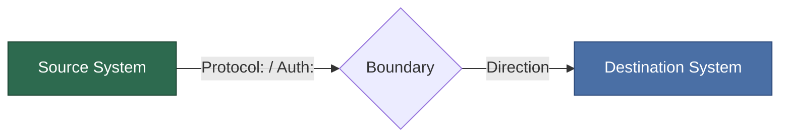

<!--
Living-ADR status vocabulary — the ONLY valid values (never "Accepted"):
  hypothesis   — decided, not yet built
  implementing — being built
  validated    — built and confirmed against the ## Confirmation criteria below
  revising     — under active change
  superseded   — replaced by a newer ADR (set status: superseded here; the
                 successor declares `supersedes: ADR-XXX` in its frontmatter)
The architecture-quality gate rejects the legacy `accepted` term outright.
-->

## Diagram

_Required when this ADR introduces a new external actor, a new service, a new data-flow direction across a system boundary, or a new protocol. Write "N/A — pure policy/convention ADR" with a one-sentence justification for exempt cases (e.g. "We use Prettier 3.x — no boundaries change")._

_Use mermaid. A flowchart/sequence/C4-lite that shows source, destination, direction, protocol, and hosting responsibility eliminates the class of error where a reader reads three alternatives of prose and still misses that a new API has to be built and hosted somewhere. See the repo's process-flow document for factory-specific motivating incidents._

---

## Context

**What is the issue we're trying to solve?**

_Example: Our current notification system sends all reminders via push notifications. However, some users have their phones on silent or do not check notifications regularly. We need a more reliable way to ensure critical notifications reach users._

**What forces are at play?**

_Example:_

- _Cost: SMS notifications cost $0.05 per message_
- _Reliability: Push notifications have 60% open rate, SMS has 95% read rate within 3 minutes_
- _User preference: Some users prefer push-only, others need SMS escalation_
- _Regulatory: Compliance frameworks may require "reasonable measures" to ensure delivery_
- _Technical: SMS provider integration adds external dependency_

---

## Decision

**What did we decide?**

_Example: We will implement a three-tier escalation strategy:_

1. _In-app notification (immediate)_
2. _Push notification to mobile app (after 5 minutes if not acknowledged)_
3. _SMS fallback (after 15 minutes if still not acknowledged, opt-in only)_

_SMS will be configurable per user and per notification type. Critical notifications will always use SMS escalation._

---

## Alternatives Considered

### Alternative 1: [Name]

**Description:** _Example: Push notifications only, no SMS_

**Pros:**

- _Zero additional cost_
- _Simpler implementation_

**Cons:**

- _Lower reliability for users who miss push notifications_
- _Potential compliance risk (not "reasonable measures")_

**Why rejected:** _Reliability concerns and compliance risk outweigh cost savings._

---

### Alternative 2: [Name]

**Description:** _Example: SMS for all notifications, no escalation_

**Pros:**

- _Highest reliability (95% read rate)_
- _Simple logic (no escalation tiers)_

**Cons:**

- _High cost ($0.05 × 4 notifications/day × 30 days = $6/user/month)_
- _User annoyance (some users prefer quiet push notifications)_

**Why rejected:** _Cost unsustainable at scale, inflexible for user preferences._

---

### Alternative 3: [Name]

**Description:** _Example: Email escalation instead of SMS_

**Pros:**

- _Zero cost_
- _Users already have email configured_

**Cons:**

- _Users check email infrequently (days, not minutes)_
- _Not suitable for time-sensitive notifications_

**Why rejected:** _Insufficient timeliness for the notification use case._

---

## Consequences

### Positive

- _Higher notification delivery rate (estimated +15% based on SMS read rates)_
- _User choice (opt-in SMS vs push-only)_
- _Compliance-ready (demonstrates "reasonable measures" if required)_
- _Scalable (cost only incurred for users who need SMS)_

### Negative

- _Increased operational cost (estimated $1.50/user/month for SMS-enabled users)_
- _External dependency on SMS provider (e.g., Twilio, AWS SNS)_
- _Additional complexity in notification logic_
- _SMS delivery failures need monitoring and retry logic_

### Risks

- _SMS provider outage impacts critical notifications_
  - **Mitigation:** Health check SMS provider API, alert on failures, fallback to email
- _Cost overrun if many users enable SMS_
  - **Mitigation:** Monitor SMS spend, budget alerts, consider bulk SMS pricing
- _Notification fatigue (too many channels)_
  - **Mitigation:** User controls for each escalation tier, smart delay tuning

---

## Confirmation

_How do we detect that this decision has drifted? A living ADR carries at least
one **drift-measurable** checkbox — a one-line claim plus an executable command
(Loki/`gh`/`curl`/bash/test) that stays green only while the decision holds. The
command must actually run against the real repo or a live system; prose like
"team reviewed" or "tests pass" (no command) is rejected by the
architecture-quality gate. Check a box (`- [x]`) once its criterion is observed._

_Example:_

- [ ] The escalation service applies the SMS fallback tier — verifies via: `bash -c 'grep -q "NotificationEscalationService" src/notifications/escalation.ts'`
- [ ] SMS delivery success is monitored (no silent provider outage) — verifies via: `{service="notifications"} |= "sms_delivery_failed"`

---

## Implementation Notes

_Example:_

- _Use SMS provider SDK (e.g., Twilio, AWS SNS) for delivery_
- _Store SMS opt-in preference in User entity_
- _Store escalation config in NotificationType entity_
- _Add NotificationEscalationService to handle tier logic_
- _Add background job to process escalations (scheduled task every 1 minute)_
- _Add monitoring dashboard for SMS delivery success rate_

---

## References

- _[Link to user research on notification preferences]_
- _[Link to compliance requirements documentation]_
- _[Link to SMS provider pricing documentation]_
- _[Link to spike PR testing SMS integration]_

---

**Template version:** 1.0
**Last updated:** 2026-02-09
